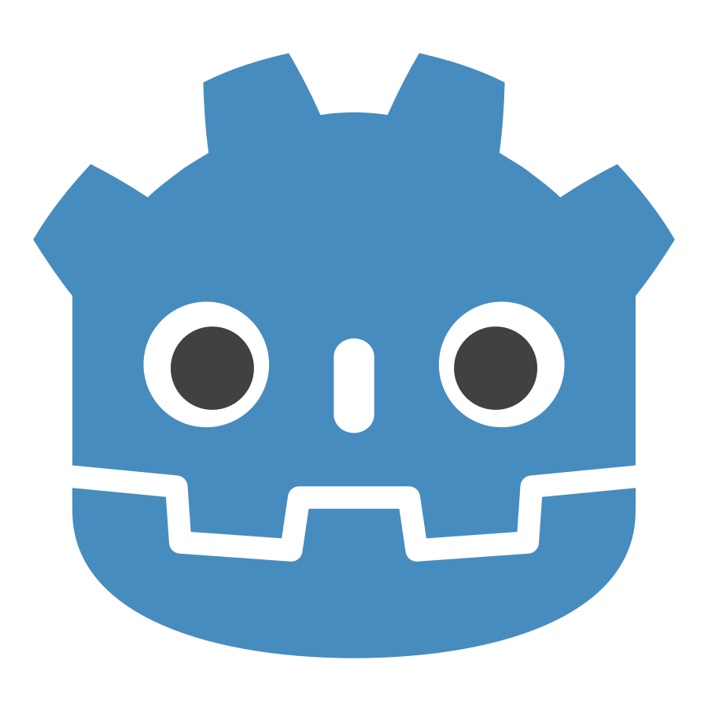
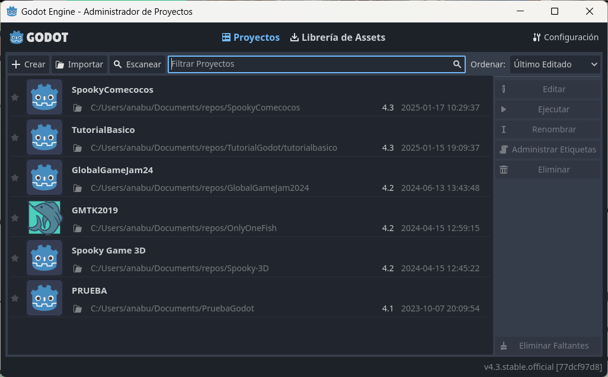
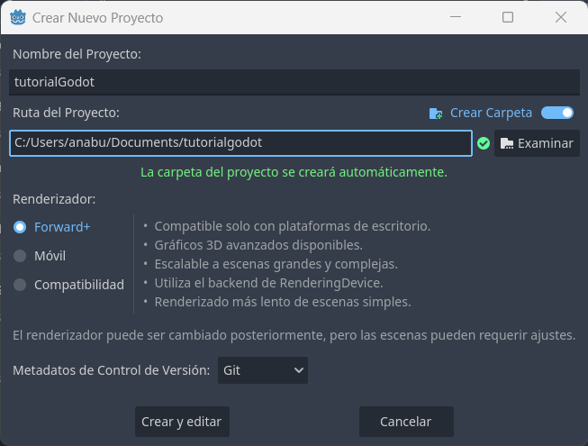
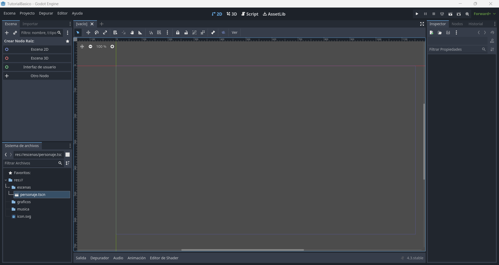

# Tutorial de Godot

> Hecho por Mapachana

## Información del tutorial y repositorio

En este repositorio se encuentra un tutorial de Godot básico, donde se van a explicar los aspectos y conceptos básicos del motor, así como cómo realizar un juego.

Para este tutorial se ha usado la versión 4.3 de Godot.

La estructura del repositorio consiste en un fichero README que contiene el tutorial (el que estás leyendo ahora mismo, sí), una carpeta `img` para contener las capturas de este documento y la carpeta `tutorialbasico` con los ficheros del proyecto del juego.

Dentro de la carpeta `tutorialbasico` se encuentran los ficheros de configuración y 3 carpetas para la organización del proyecto: `escenas`, `graficos` y `musica`, que se explicarán en profundidad más adelante, pero en general, se tiene:

- `escenas`: Escenas y scripts del proyecto.
- `graficos`: Sprites, fondos, etc. del proyecto.
- `musica`: Música y efectos de sonido del proyecto.

## ¿Qué es Godot? ¿Por qué iba yo a usar Godot?

[Godot](https://godotengine.org/) es un motor de videojuegos que ofrece una interfaz sencilla y herramientas para desarrollar videojuegos de forma intuitiva.

Entre los motivos para usar este motor destacamos:

- Motor ligero.
- Intuitivo.
- Es software libre.
- Disponible para Windows, Linux, Mac, Android y Web.
- Permite desarrollar videojuegos para ordenador, móvil y Web.
- Tiene documentación amplia y detallada.

## Instalando Godot

Instalar Godot es realmente sencillo. En este tutorial vamos a instalar la última versión estable. Para ello, accedemos [aquí](https://godotengine.org/download/windows/), a la página de descargas de Godot.

Pulsamos descargar la última estable en nuestro sistema operativo, y se nos descarga un archivo comprimido. Descomprimimos el archivo y listo, ya está instalado.

Pulsamos en el ejecutable sin consola, y se abrirá Godot.

> Nota: Si estás en linux puede que necesites darle permisos de ejecución, para ello usa `chmod +x archivo`.

## Creando un proyecto

Al hacer doble click en el ejecutable de Godot, se nos abre la primera ventana, relativa a proyectos.

En esta ventana vemos listados todos los proyectos de Godot, y para cada uno se indica su nombre, un icono del mismo, la ruta de dónde está guardado este proyecto, para qué versión de Godot se desarrolló y la última fecha de acceso.

En la parte de arriba, encontramos, de derecha a izquierda, botones para crear un nuevo proyecto, importarlo o escanear en busca de más proyectos. También tenemos una barra de búsqueda y en qué orden se muestran.

En la barra lateral de la derecha encontramos qué acción queremos realizar con el proyecto seleccionado, editarlo, ejecutarlo, renombrarlo, cambiarle las etiquetas o borrarlo.

Para crear el proyecto, pulsamos en el botón `Crear`.

Se nos muestra la siguiente pantalla:

En esta ventana indicamos el nombre del proyecto, en este caso `tutorialGodot` y especificamos donde se va a guardar el proyecto. Podemos escribir la ruta o pulsar en `Examinar` y seleccionar la carpeta. Es importante que se trabaje en una carpeta vacía.

Finalmente, nos fijamos en que Godot tiene integrado el uso de control de versiones, en este caso se va a usar `Git`.

Finalmente pulsamos `Crear y editar`, y ya tenemos creado el proyecto.

Una vez creado el proyecto, vamos a abrir la carpeta donde se ha creado y, además de los ficheros automáticos que genera godot, vamos a crear una pequeña estructura de carpetas para organizar los ficheros necesarios.

La estructura de carpetas es algo personal, y puedes realizarla como prefieras. Para este tutorial vamos a crear las siguientes carpetas:

- escenas: En esta carpeta vamos a guardar todos los ficheros de escenas y sus scripts.
- graficos: En esta carpeta se guardan todos los gráficos y sprites del juego.
- musica: En esta carpeta se guardarán la música y efectos de sonido.

## La interfaz

Al crear el proyecto, se nos abre la siguiente ventana:

Vamos a hablar, en general, de las partes que vemos en esta interfaz:

En la parte superior izquierda, vemos unos desplegables `Escena`, `Proyecto`, `Depurar`, `Editor` y `Ayuda`. En el desplegable de `Escena` podemos crear escenas, en los demás desplegables tenemos la configuración del proyecto, depuración, el editor y la pestaña de ayuda.

En la parte superior derecha vemos unos iconos que son los que usaremos para ejecutar el juego, pausarlo, detenerlo, exportarlo, ejecutar la escena actual, ejecutar una escena específica o cambiar el renderizado del juego.

En el centro se van a mostrar los elementos gráficos (personajes, niveles, etc.) tanto en 2D, 3D y el código. Se cambia la visión seleccionando qué visor se quiere en cada momento en la parte de arriba. Además arriba en las pestañas se mostrarán las escenas abiertas.

En el panel lateral izquierdo distinguimos dos partes:

En el lateral izquierdo arriba se muestra la estructura de nodos de dicha escena y el menú de importación de imágenes, para cambiar las propiedades de importación de diferentes elementos.

En el lateral izquierdo abajo se muestra la estructura de ficheros del proyecto.

En el panel lateral derecho se van a mostrar las propiedades de los nodos para editarlo, los listeners y el historial.

La parte inferior muestra la consola de salida y depurador, así como los menús de animaciones, sonidos y shaders cuando sea pertinente.

## Escenas y nodos

En Godot trabajamos con escenas y nodos. Debemos tener en cuenta que es programación orientada a objetos a la hora de comprender estos conceptos.

Los nodos son las unidades básicas de Godot, cada nodo tiene una funcionalidad específica, como contener sprites, reproducir música, realizar animaciones o colisionadores.

Las escenas son conjuntos de nodos jerárquicamente organizados en un árbol que pueden reutilizarse e instanciarse en otras escenas. Una escena puede ser un personaje, un obstáculo, la pantalla de menús inicial del juego o el nivel.

En este tutorial el juego a desarrollar va a realizarse en 2D, pero (prácticamente) todo nodo 2D tiene su equivalente en 3D.

### Escena de jugador

## Scripts

## Animaciones

## Musiquita

## Menús e Interfaces

## Publicando tu obra maestra