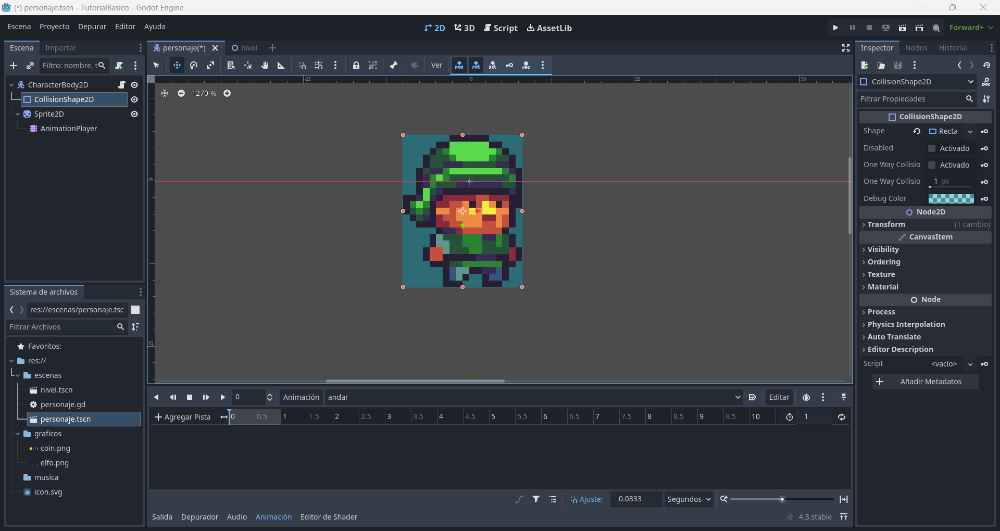
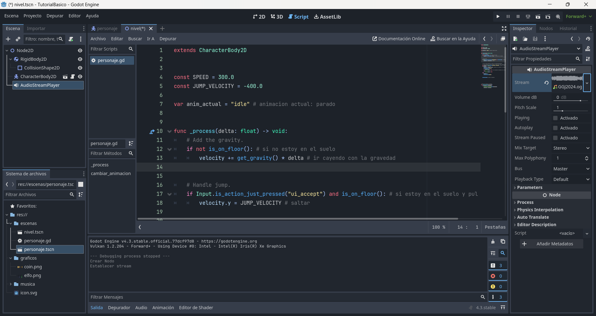

# Tutorial de Godot

> Hecho por Mapachana

## Índice

- [Tutorial de Godot](#tutorial-de-godot)
	- [Índice](#índice)
	- [Información del tutorial y repositorio](#información-del-tutorial-y-repositorio)
	- [¿Qué es Godot? ¿Por qué iba yo a usar Godot?](#qué-es-godot-por-qué-iba-yo-a-usar-godot)
	- [Instalando Godot](#instalando-godot)
	- [Creando un proyecto](#creando-un-proyecto)
	- [La interfaz](#la-interfaz)
	- [Escenas y nodos](#escenas-y-nodos)
		- [Escena de jugador](#escena-de-jugador)
		- [Escena de monedas](#escena-de-monedas)
		- [Escena de nivel](#escena-de-nivel)
	- [Scripts](#scripts)
		- [Script de personaje](#script-de-personaje)
		- [Script global](#script-global)
		- [Script de nivel](#script-de-nivel)
		- [Script de monedas](#script-de-monedas)
	- [Animaciones](#animaciones)
		- [Animación de personaje](#animación-de-personaje)
	- [Musiquita](#musiquita)
		- [Música de fondo para el nivel](#música-de-fondo-para-el-nivel)
	- [Menús e Interfaces](#menús-e-interfaces)
		- [Contador de monedas](#contador-de-monedas)
		- [Menú de inicio](#menú-de-inicio)
	- [Publicando tu obra maestra](#publicando-tu-obra-maestra)


## Información del tutorial y repositorio

En este repositorio se encuentra un tutorial de Godot básico, donde se van a explicar los aspectos y conceptos básicos del motor, así como cómo realizar un juego.

Para este tutorial se ha usado la versión 4.3 de Godot.

La estructura del repositorio consiste en un fichero README que contiene el tutorial (el que estás leyendo ahora mismo, sí), una carpeta `img` para contener las capturas de este documento y la carpeta `tutorialbasico` con los ficheros del proyecto del juego.

Dentro de la carpeta `tutorialbasico` se encuentran los ficheros de configuración y 3 carpetas para la organización del proyecto: `escenas`, `graficos` y `musica`, que se explicarán en profundidad más adelante, pero en general, se tiene:

- `escenas`: Escenas y scripts del proyecto.
- `graficos`: Sprites, fondos, etc. del proyecto.
- `musica`: Música y efectos de sonido del proyecto.

## ¿Qué es Godot? ¿Por qué iba yo a usar Godot?


[Godot](https://godotengine.org/) es un motor de videojuegos que ofrece una interfaz sencilla y herramientas para desarrollar videojuegos de forma intuitiva.

Entre los motivos para usar este motor destacamos:

- Motor ligero.
- Intuitivo.
- Es software libre.
- Disponible para Windows, Linux, Mac, Android y Web.
- Permite desarrollar videojuegos para ordenador, móvil y Web.
- Tiene documentación amplia y detallada.

## Instalando Godot

Instalar Godot es realmente sencillo. En este tutorial vamos a instalar la última versión estable. Para ello, accedemos [aquí](https://godotengine.org/download/windows/), a la página de descargas de Godot.

Pulsamos descargar la última estable en nuestro sistema operativo, y se nos descarga un archivo comprimido. Descomprimimos el archivo y listo, ya está instalado.

Pulsamos en el ejecutable sin consola, y se abrirá Godot.

> Nota: Si estás en linux puede que necesites darle permisos de ejecución, para ello usa `chmod +x archivo`.

## Creando un proyecto

Al hacer doble click en el ejecutable de Godot, se nos abre la primera ventana, relativa a proyectos.


En esta ventana vemos listados todos los proyectos de Godot, y para cada uno se indica su nombre, un icono del mismo, la ruta de dónde está guardado este proyecto, para qué versión de Godot se desarrolló y la última fecha de acceso.

En la parte de arriba, encontramos, de derecha a izquierda, botones para crear un nuevo proyecto, importarlo o escanear en busca de más proyectos. También tenemos una barra de búsqueda y en qué orden se muestran.

En la barra lateral de la derecha encontramos qué acción queremos realizar con el proyecto seleccionado, editarlo, ejecutarlo, renombrarlo, cambiarle las etiquetas o borrarlo.

Para crear el proyecto, pulsamos en el botón `Crear`.

Se nos muestra la siguiente pantalla:


En esta ventana indicamos el nombre del proyecto, en este caso `tutorialGodot` y especificamos donde se va a guardar el proyecto. Podemos escribir la ruta o pulsar en `Examinar` y seleccionar la carpeta. Es importante que se trabaje en una carpeta vacía.

Finalmente, nos fijamos en que Godot tiene integrado el uso de control de versiones, en este caso se va a usar `Git`.

Finalmente pulsamos `Crear y editar`, y ya tenemos creado el proyecto.

Una vez creado el proyecto, vamos a abrir la carpeta donde se ha creado y, además de los ficheros automáticos que genera godot, vamos a crear una pequeña estructura de carpetas para organizar los ficheros necesarios.

La estructura de carpetas es algo personal, y puedes realizarla como prefieras. Para este tutorial vamos a crear las siguientes carpetas:

- escenas: En esta carpeta vamos a guardar todos los ficheros de escenas y sus scripts.
- graficos: En esta carpeta se guardan todos los gráficos y sprites del juego.
- musica: En esta carpeta se guardarán la música y efectos de sonido.

## La interfaz

Al crear el proyecto, se nos abre la siguiente ventana:


Vamos a hablar, en general, de las partes que vemos en esta interfaz:

En la parte superior izquierda, vemos unos desplegables `Escena`, `Proyecto`, `Depurar`, `Editor` y `Ayuda`. En el desplegable de `Escena` podemos crear escenas, en los demás desplegables tenemos la configuración del proyecto, depuración, el editor y la pestaña de ayuda.

En la parte superior derecha vemos unos iconos que son los que usaremos para ejecutar el juego, pausarlo, detenerlo, exportarlo, ejecutar la escena actual, ejecutar una escena específica o cambiar el renderizado del juego.

En el centro se van a mostrar los elementos gráficos (personajes, niveles, etc.) tanto en 2D, 3D y el código. Se cambia la visión seleccionando qué visor se quiere en cada momento en la parte de arriba. Además arriba en las pestañas se mostrarán las escenas abiertas.

En el panel lateral izquierdo distinguimos dos partes:

En el lateral izquierdo arriba se muestra la estructura de nodos de dicha escena y el menú de importación de imágenes, para cambiar las propiedades de importación de diferentes elementos.

En el lateral izquierdo abajo se muestra la estructura de ficheros del proyecto.

En el panel lateral derecho se van a mostrar las propiedades de los nodos para editarlo, los listeners y el historial.

La parte inferior muestra la consola de salida y depurador, así como los menús de animaciones, sonidos y shaders cuando sea pertinente.

## Escenas y nodos

En Godot trabajamos con escenas y nodos. Debemos tener en cuenta que es programación orientada a objetos a la hora de comprender estos conceptos.

Los nodos son las unidades básicas de Godot, cada nodo tiene una funcionalidad específica, como contener sprites, reproducir música, realizar animaciones o colisionadores.

Las escenas son conjuntos de nodos jerárquicamente organizados en un árbol que pueden reutilizarse e instanciarse en otras escenas. Una escena puede ser un personaje, un obstáculo, la pantalla de menús inicial del juego o el nivel.

En este tutorial el juego a desarrollar va a realizarse en 2D, pero (prácticamente) todo nodo 2D tiene su equivalente en 3D.

### Escena de jugador

Vamos a ir creando, poco a poco, un pequeño juego para aterrizar todos los conceptos y uso del motor que estamos viendo. El videojuego que vamos a desarrollar va a ser un PseudoMario, pues va a ser una versión ligeramente simplificada del mismo.

Vamos a comenzar el proyecto creando la escena del jugador, que llamamos `personaje.tscn` y almacenamos en la carpeta `escenas`. Para ello, en el menú lateral izquierda vamos a comenzar añadiendo el nodo raíz de la escena.

Dado que es un personaje y por tanto tendrá colisiones y se mueve, pulsamos en `Otro Nodo`, seleccionamos `CharacterBody2D` y le damos a `Crear`:


Una vez añadido, vemos que el nodo aparece en el panel izquierdo y se muestra una exclamación de advertencia, ya que el nodo `CharacterBody2D` está preparado para comprobar las colisiones, y por tanto necesida que se le indique la forma del colisionador.


Seleccionamos el nodo que acabamos de crear y pulsamos el `+` de la parte superior del panel para crear un nodo hijo. Seleccionamos un `CollisionShape2D` para indicar la forma del colisionador.

Este nuevo nodo vuelve a tener un signo de exclamación, pues aunque tenemos un nodo para almacenar la forma de la colisión, no le hemos indicado cuál es. Seleccionamos el nodo y en el panel derecho se muestran las propiedades de dicho nodo. Buscamos la propiedad `Shape` y en dicho desplegable indicaremos qué forma tiene el colisionador. Normalmente se usan rectángulos (`Nuevo RectangleShape2D`) o cápsulas (`Nuevo CapsuleShape2D`).


Una vez seleccionada la forma ya podemos ajustarla al tamaño que queramos usando el editor gráfico en la parte central de la pantalla, y tendremos un colisionador funcionando.

El tamaño del colisionador deberá ser el tamaño del sprite o imagen de nuestro personaje.

Vamos a añadir el al nodo raíz un nuevo nodo hijo `Sprite2D` y en la barra de la derecha, pulsamos en la propiedad `texture` para indicar cuál debe usar pulsando en `Cargar` y seleccionando de nuestra carpeta de gráficos `elfo.png`.


Dado que nuestro personaje tiene una spritesheet, debemos indicarle que solo coja uno de los elfos, para ello iremos a la propiedad `hframes` y `vframes` de `Animation`, que indica cuántos frames verticales y horizontales tiene el spritesheet cargado. En este caso hay 23 elfos en línea, así basta ajustar los valores como se ve:


Sin embargo nuestro pixelart se ve borroso, para corregir esto iremos a `Proyecto` -> `Configuración del proyecto` -> `Renderizado` -> `Texturas` y en lugar de `Linear` seleccionamos `Nearest.`


Aunque todavía no vayamos a hacer las animaciones, vamos a dejar añadido un nodo `AnimationPlayer` como hijo de `Sprite2D`.

Finalmente ajustamos nuestro colisionador para que quede centrado y alineado con el sprite con el ratón.


> Nota: En general, se suelen tener colisiones cuando trabajamos con un jugador, por eso se ha usado `CharacterBody2D`, pero si no queremos que colisione y nos basta con que detecte que algo ha entrado en su área o región, por ejemplo para proyectiles o zonas en las que debe ocurrir un evento, se usa el nodo,  `Area2D`. 

### Escena de monedas

Esta escena va a tener una estructura muy similar a la del jugador, pero el nodo raíz será un `Area2D`, ya que no necesita colisiones ni desplazarse.

Así, tendremos un `Area2D` que tiene por hijos un `CollisionShape2D` y un `Sprite2D`, teniendo este último un hijo `AnimationPlayer`. Cargamos además los gráficos de la moneda de manera análoga a como lo hicimos el elfo, teniendo la moneda 6 frames.


### Escena de nivel

La escena del nivel será en la que combinaremos todos los elementos y escenas para que el jugador la juegue.

Esta escena tendrá por nodo raíz un `Node2D`, y para jugar en ella vamos a comenzar creando un suelo.

Dado que el suelo debe colisionar con el personaje para que este no se caiga pero no va a moverse, será un `RigidBody2D`. A este nodo le añadiremos su correspondiente `CollisionShape2D` y un `Sprite2D` para verlo.

Después instanciaremos nuestra escena de personaje, para ello pulsaremos en el clip en lugar de en el + del panel izquierdo, y seleccionaremos nuestra escena de personaje como hija del nodo raíz.

Análogamente instanciamos nuestra moneda y colocamos los elementos con el ratón.

Para que la cámara siga al personaje y podamos jugar con el zoom, añadimos una cámara como hija del personaje (para que lo siga) y en sus propiedades ponemos la escala a 3 para que se vea bien.

Añadimos otro nodo `AudioStreamPlayer` para la música de fondo.

Finalmente para la interfaz del contador de calabazas añadimos un nodo `CanvasLayer` para que esta interfaz no se mueva de la pantalla, y como hija suya una etiqueta `Label` donde se mostrará el número de monedas.

El resultado debe ser similar a esto:


## Scripts

Los scripts son ficheros de código que suelen ir asociados a escenas, aunque no siempre.

Para programar en godot podemos usar dos lenguajes: c# y gdscript, que es el lenguaje propio de godot y es muy similar a python.

No debemos olvidar que godot nos ofrece métodos ya preparados para por ejemplo colisionar, moverse o reproducir animaciones.

En este tutorial vamos a programar empleando gdscript.

### Script de personaje

Vamos a continuar desarrollando nuestro personaje añadiendo controles para poder moverlo. Para ello vamos a añadir un script a su escena pulsando sobre el pergamino con el + que se ve en el panel izquierdo:


Le damos a crear y nos aparece un fichero con código ya hecho como el siguiente:

```python
extends CharacterBody2D 


const SPEED = 300.0
const JUMP_VELOCITY = -400.0


func _physics_process(delta: float) -> void:
	# Add the gravity.
	if not is_on_floor():
		velocity += get_gravity() * delta

	# Handle jump.
	if Input.is_action_just_pressed("ui_accept") and is_on_floor():
		velocity.y = JUMP_VELOCITY

	# Get the input direction and handle the movement/deceleration.
	# As good practice, you should replace UI actions with custom gameplay actions.
	var direction := Input.get_axis("ui_left", "ui_right")
	if direction:
		velocity.x = direction * SPEED
	else:
		velocity.x = move_toward(velocity.x, 0, SPEED)

	move_and_slide()
```

En este código ya tenemos muchos aspectos básicos, por ejemplo la primera línea nos indica cuál es el nodo raíz de la escena.

Después tenemos el equivalente a atributos de la clase, que además son constantes, `SPEED` y `JUMP_VELOCITY`, velocidades fijas que usaremos para el movimiento.

A continuación encontramos la función `_physics_process(delta: float)` que es una función que tiene en cuenta físicas y se ejecuta cada frame. Recibe como argumento `delta` que es el tiempo entre dos frames. Esta función se ejecuta continuamente.

Sin embargo, nosotros no vamos a usar físicas realistas, así que vamos a quitar esa función y en su lugar usar `process(delta)`.

Godot tiene ya incorporadas diversos métodos para los nodos `CharacterBody2D`, como por ejemplo `is_on_floor()`, que comprueba si el nodo está en el suelo o `move_and_slide()` para desplazar al personaje comprobando las colisiones.

El código del personaje quedaría como sigue:

```python
extends CharacterBody2D


const SPEED = 300.0
const JUMP_VELOCITY = -400.0


func _process(delta: float) -> void:
	# Add the gravity.
	if not is_on_floor(): # si no estoy en el suelo
		velocity += get_gravity() * delta # ir cayendo con la gravedad


	# Handle jump.
	if Input.is_action_just_pressed("ui_accept") and is_on_floor(): # si estoy en el suelo y pulso saltar
		velocity.y = JUMP_VELOCITY # saltar


	# Get the input direction and handle the movement/deceleration.
	# As good practice, you should replace UI actions with custom gameplay actions.
	var direction := Input.get_axis("ui_left", "ui_right") # recoger el input a izquierda y derecha
	if direction: # Si hay input
		velocity.x = direction * SPEED # movereme en la dirección a la velocidad
		if velocity.x < 0:
			$Sprite2D.flip_h = true # si la velocidad es negativa voy a la izquierda y por tanto volteo el sprite
		else:
			$Sprite2D.flip_h = false
	else:
		velocity.x = 0 # si no hay input me paro


	move_and_slide() # moverse y colisionar
```

Con este código nuestro personaje ya podrá moverse a izquierda y derecha y saltar. Para cambiar la velocidad solo hará falta modificar las constantes ya vistas.

Una vez tenemos el script podremos ir a la escena del nivel y ejecutarla para comprobar que el personaje se mueve correctamente.

### Script global

Vamos a añadir un script global, esto es, un script que no está asociado a ninguna escena, se carga al inicio y sirve como controlador. Para ello vamos a ir a `Proyecto`->`Configuración de Proyecto`->`Globales`->`Autoload`. Ahí indicamos el nombre del script, en este caso `controlador` y lo añadimos.


Este script contendrá el contador de monedas recogidas, la escena actual del juego para permitirnos cambiar entre escenas y la ruta a la etiqueta donde se mostrará en el nivel las monedas recogidas.

La función `_ready` se ejecuta al crear la escena, una sola vez. En este caso obtenemos el árbol del proyecto y guardamos la escena actual.

Añadimos dos funciones para cambiar entre escenas `goto_scene` y `_deferred_goto_scene`.

Finalemente tenemos una función que actualice el contador de monedas y lo muestre en la pantalla del nivel cambiando la etiqueta correspondiente.

```python
extends Node

var num_monedas = 0 # contador de monedas

var ruta_etiqueta_nivel = null

var current_scene = null

func _ready():
	var root = get_tree().root
	current_scene = root.get_child(root.get_child_count() - 1)


# Called every frame. 'delta' is the elapsed time since the previous frame.
func _process(delta: float) -> void:
	pass
	
	
func goto_scene(path):
	# This function will usually be called from a signal callback,
	# or some other function in the current scene.
	# Deleting the current scene at this point is
	# a bad idea, because it may still be executing code.
	# This will result in a crash or unexpected behavior.

	# The solution is to defer the load to a later time, when
	# we can be sure that no code from the current scene is running:

	call_deferred("_deferred_goto_scene", path)


func _deferred_goto_scene(path):
	# It is now safe to remove the current scene.
	current_scene.free()

	# Load the new scene.
	var s = ResourceLoader.load(path)

	# Instance the new scene.
	current_scene = s.instantiate()

	# Add it to the active scene, as child of root.
	get_tree().root.add_child(current_scene)

	# Optionally, to make it compatible with the SceneTree.change_scene_to_file() API.
	get_tree().current_scene = current_scene

# actualiza el contador de monedas
func actualizar_contador_monedas():
	num_monedas += 1
	ruta_etiqueta_nivel.text = "MONEDAS: "+ str(num_monedas)
	pass

```

### Script de nivel

El nivel solamente constará de una función `_ready` que se ejeute al inicio, con el objetivo de, una vez creado el nivel, indicarle la ruta de la etiqueta de la interfaz donde se mostrará la cuenta de monedas total al controlador:

```python
extends Node2D


# Called when the node enters the scene tree for the first time.
func _ready() -> void:
	Controlador.ruta_etiqueta_nivel = $CanvasLayer/Label # guardo la ruta de la etiqueta para actualizarla en el controlador
	pass # Replace with function body.


# Called every frame. 'delta' is the elapsed time since the previous frame.
func _process(delta: float) -> void:
	pass
```

### Script de monedas

Finalmente vamos a añadirle un script a las monedas para que cuando las coja el personaje se actualice el contador de monedas y estas desaparezcan.

En la escena de moneda seleccionamos el `Area2D` y en el panel derecho, en `Nodos` pulsamos doble click sobre el evento `on_body_entered`.


Esto nos generará un listener o evento, que hará que cuando un cuerpo, en este caso el perosnaje, entre en el area delimitada por la forma de colisión de la moneda se ejecute el código de este método.

Así, este script quedaría como sigue:

```python
extends Area2D


# Called when the node enters the scene tree for the first time.
func _ready() -> void:
	pass # Replace with function body.


# Called every frame. 'delta' is the elapsed time since the previous frame.
func _process(delta: float) -> void:
	pass


# Cuando entra un cuerpo en el area
func _on_body_entered(body: Node2D) -> void:
	Controlador.actualizar_contador_monedas() # actualizo contador de monedas
	queue_free() # elimino la moneda
	pass # Replace with function body.
```

## Animaciones

Crear una animación consiste básicamente en indicarle al editor qué propiedades debe cambiar y en qué momento.

Las animaciones más usuales son por ejemplo las de andar o saltar, pero también pueden ser explosiones u otros detalles.

Para realizar animaciones, usaremos los nodos `AnimationPlayer`.

### Animación de personaje

Para hacer animaciones vamos a abrir el editor de animaciones de la parte inferior. Vamos a crear una animación del elfo andando.


Pulsaremos en `Animación` y añadir nueva pista.



En la parte superior izquierda podemos reproducir o parar las animaciones. En la parte superior seleccionaremos la animación a editar. A la derecha se muestra la duración total de la animación y si se reproduce en bucle.

En la parte inferior, en `Ajuste` se especifica el tiempo cada el que cambia la propiedad a editar.

Vamos a seleccionar el nodo `Sprite2D` y en el inspector de nodos, en la propiedad `frame` pulsamos la llave dos veces. Esto crea la pista de animación de dicha propiedad y le da el primer valor el especificado en los atributos del nodo.


Seguimos pulsando reiteradas veces en la llave de dicha propiedad para que vaya indicando los frames a usar, cada tiempo ajuste, del frame. Ajustamos el tiempo total de la animación y hacemos que se reproduzca en bucle.


También crearemos una animación `idle` donde el muñeco no se mueve, y por tanto es solamente un frame para cuando está quieto.

Ahora vamos a editar el script de personaje, añadiendo un atributo con la animación que se esta reproduciendo en ese momento, una función para cambiar de animación para impedir que se empiece a reproducir múltiples veces al tener un input continuo y voltear los sprites cuando el personaje se mueve a la izquierda.

Para darle la vuelta a los sprites usamos la propiedad `flip_h` que tienen los sprites por defecto.

```python
extends CharacterBody2D


const SPEED = 300.0
const JUMP_VELOCITY = -400.0

var anim_actual = "idle" # animacion actual: parado


func _process(delta: float) -> void:
	# Add the gravity.
	if not is_on_floor(): # si no estoy en el suelo
		velocity += get_gravity() * delta # ir cayendo con la gravedad


	# Handle jump.
	if Input.is_action_just_pressed("ui_accept") and is_on_floor(): # si estoy en el suelo y pulso saltar
		velocity.y = JUMP_VELOCITY # saltar


	# Get the input direction and handle the movement/deceleration.
	# As good practice, you should replace UI actions with custom gameplay actions.
	var direction := Input.get_axis("ui_left", "ui_right") # recoger el input a izquierda y derecha
	if direction: # Si hay input
		velocity.x = direction * SPEED # movereme en la dirección a la velocidad
		cambiar_animacion("andar")
		if velocity.x < 0:
			$Sprite2D.flip_h = true # si la velocidad es negativa voy a la izquierda y por tanto volteo el sprite
		else:
			$Sprite2D.flip_h = false
	else:
		velocity.x = 0 # si no hay input me paro
		cambiar_animacion("idle")


	move_and_slide() # moverse y colisionar
	

# funcion para cambiar de animacion
func cambiar_animacion(nombre_anim):
	if nombre_anim != anim_actual:
		$Sprite2D/AnimationPlayer.play(nombre_anim)
		anim_actual = nombre_anim
```

Ya podemos ir al nivel y comprobar que ahora al moverse el elfo reproduce la animación de andar, y al no pulsar nada se para.

## Musiquita

Para añadir música al juego, ya sea música de fondo o efectos de sonidos que se escuchan al ocurrir determinados eventos, usaremos los nodos de música.

### Música de fondo para el nivel

Para que se reproduzca música en el nivel vamos a usar un nodo `AudioStreamPlayer`.

Seleccionamos el nodo y en el inspector le damos a `Cargar` y seleccionamos el archivo de música. Para que se reproduzca automáticamente al empezar la escena marcamos la propiedad `Autoplay` y ponemos el tipo de música a `stream`.




## Menús e Interfaces

Vamos a distinguir dos apartados: por un lado menús, como los que encontramos en las pantallas de comienzo y fin del juego, y por otro la interfaz del usuario, como son contadores de monedas, de vida o de tiempo.

En ambos casos usaremos etiquetas, pero en los menús usaremos botones mientras que en la interfaz con el usuario usaremos sprites u otros elementos para mostrar iconos.

### Contador de monedas

El contador de monedas ya se ha realizado durante el scripting mediante el código en el controlador y la moneda, añadiendo los nodos `CanvasLayer` y `Label` a la escena para modificarlo.
 
### Menú de inicio

Vamos a realizar un menú de inicio lo más básico posible. Comenzamos creando una nueva escena con nodo raíz `Control`. A esta escena vamos a añadir un `Label` con el nombre del juego y un botón `Button`. Además añadimos un `Sprite2D` para ponerle un fondo.

Añadimos texto a la etiqueta y el botón en sus propiedades `text` correspondientes en el panel derecho y la imagen de fondo para el Sprite y colocamos todo con el ratón.

Para cambiar el tamaño del botón iremos a `Layout`, y cambiamos también el tamaño de fuente en la etiqueta y el botón


Ahora vamos a añadir la funcionalidad del botón: creamos un script para la escena, seleccionamos el botón y le añadimos un listener para el vento `pressed`, que es cuando se pulsa el botón. Esta función llamará a nuestro controlador indicando que cambie la escena.


```python
extends Control


# Called when the node enters the scene tree for the first time.
func _ready() -> void:
	pass # Replace with function body.


# Called every frame. 'delta' is the elapsed time since the previous frame.
func _process(delta: float) -> void:
	pass

# funcion que se ejecuta al pulsar el boton
func _on_button_pressed() -> void:
	Controlador.goto_scene("res://escenas/nivel.tscn") # cambiar a escena de nivel
```

Para terminar vamos a indicar que esta escena de menú es la principal, para ello vamos a `Proyecto`->`Configuración del Proyecto`->`Ejecutar` e indicamos en la escena principal nuestro menú.


Ya podemos pulsar el play y comprobar que nos abre el menú directamente.

## Publicando tu obra maestra

mENCIÓN TILEMAPLAYER PARA TILEMAP Y TILESET Y PARALLAX

